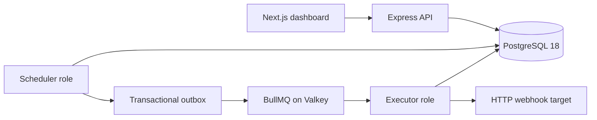

# Chronix

Chronix is a self-hostable distributed scheduler for durable outbound HTTP webhooks. PostgreSQL owns schedule and execution state, a transactional outbox bridges committed work to BullMQ on Valkey, and fenced database leases prevent stale workers from overwriting newer outcomes.

> Current release state: Phases 0–4 are implemented, tested, and merged. Hosted deployment and staging acceptance require provider credentials and are intentionally tracked outside the repository.

## Architecture



The server has two bootstraps only: `src/app.ts` for the API and `src/worker.ts` for either the scheduler or executor role. Shared business rules live below those adapters. Database migrations run as a deployment step, never during application startup.

## Guarantees and boundaries

- Webhook delivery only; Chronix never executes user-supplied code.
- PostgreSQL is authoritative. Valkey is transport and rate-limit infrastructure, not a source of truth.
- Delivery is durable at-least-once. Receivers must honor the stable idempotency key for effectively exactly-once effects.
- Schedule claiming and execution ownership use database concurrency controls and fencing generations.
- Every tenant resource is scoped to a workspace.
- Job headers, bodies, and signing secrets use versioned AES-256-GCM encryption; signing secrets are disclosed only at creation or rotation.
- Execution history is bounded by workspace retention settings and can be exported as a bounded CSV stream.
- The MVP excludes DAGs, arbitrary code execution, multi-region consensus, Kubernetes, and MFA.

## Local setup

Prerequisites: Node.js `24.19.0`, pnpm `11.21.0`, Docker with Compose, and OpenSSL.

```bash
cp server/.env.example server/.env
cp client/.env.example client/.env.local
```

Replace the JWT, HMAC, and 32-byte `APP_ENCRYPTION_KEY` placeholders in `server/.env`. Use an ES256 P-256 key pair and encode PEM line breaks as `\n` inside the env file. Then start the complete topology:

```bash
docker compose --file ops/docker-compose.yml up --build
```

The one-shot `migrate` service applies migrations before the API, scheduler, and executor start. The dashboard is available at `http://localhost:3001`; API liveness and readiness are at `http://localhost:3000/health/live` and `/health/ready`.

For package-level development:

```bash
cd server && pnpm install --frozen-lockfile && pnpm prisma:generate && pnpm dev
cd client && pnpm install --frozen-lockfile && pnpm dev
```

## Verification

```bash
cd server
pnpm install --frozen-lockfile
pnpm prisma validate
pnpm typecheck
pnpm lint
pnpm test:unit
pnpm test:integration
pnpm build
pnpm audit --audit-level=high

cd ../client
pnpm install --frozen-lockfile
pnpm typecheck
pnpm lint
pnpm build
pnpm audit --audit-level=high
```

Integration tests provision isolated PostgreSQL 18 and Valkey containers; they never reuse a developer database or silently fall back when Valkey is unavailable.

## Documentation

- [Architecture](docs/ARCHITECTURE.MD)
- [API conventions](docs/API.MD)
- [Architecture decisions](docs/DECISIONS.md)
- [Contributing](docs/CONTRIBUTING.MD)
- [Operations runbook](ops/runbooks/README.md)
- [Render Blueprint](render.yaml)

## License

Chronix is available under the [MIT License](LICENSE).
