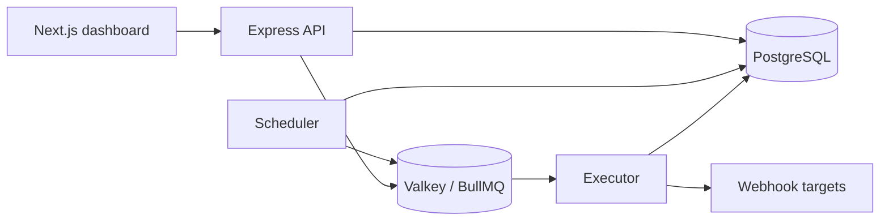

# Chronix

Chronix is a multi-tenant control plane for scheduling and delivering outbound HTTP webhooks. It is deliberately more than a cron-expression wrapper: PostgreSQL owns durable state, a transactional outbox bridges committed work to BullMQ on Valkey, and fenced database leases prevent stale workers from overwriting newer outcomes.

The repository contains an Express API, independently scalable scheduler and executor processes, and a Next.js operations dashboard.

## Architecture



- Schedule advancement, execution creation, and outbox insertion commit atomically.
- Scheduler claims use `FOR UPDATE SKIP LOCKED`; unique constraints make retries safe.
- Execution claims use expiring leases and fencing generations for stale-worker recovery.
- Delivery is at-least-once. Receivers can deduplicate using stable execution and attempt headers.
- Every repository query is workspace-scoped; generated Prisma models remain behind domain/DTO mappings.
- Webhook delivery validates and pins resolved addresses, revalidates redirects, blocks private networks, and bounds response capture.
- Job secrets are encrypted with versioned AES-256-GCM and sensitive headers are redacted.

## Product surface

Chronix provides workspace-aware authentication and API keys, job and schedule lifecycle management, cron/timezone/DST policies, manual idempotent triggers, retries and dead-letter outcomes, execution timelines, worker heartbeats, audit events, OpenAPI 3.1, Prometheus metrics, OpenTelemetry hooks, retention, and streaming execution export.

The API lives under `/api/v1`. JSON responses use either `{ data, meta: { requestId } }` or `{ error, meta: { requestId } }`; list endpoints are bounded and cursor-paginated. The generated OpenAPI document is served at `/api/v1/openapi.json`.

## Run locally

Prerequisites: Node.js `24.19.0`, pnpm `11.21.0`, Docker with Compose, and OpenSSL.

```bash
nvm use
corepack enable
corepack prepare pnpm@11.21.0 --activate

cd server
pnpm install --frozen-lockfile
pnpm setup:local

cd ../client
pnpm install --frozen-lockfile
cp .env.example .env.local

cd ..
docker compose --file ops/docker-compose.yml up --build
```

`pnpm setup:local` creates `server/.env.local` with local-only cryptographic material. The one-shot Compose migration service deploys the Prisma migrations before the API, scheduler, and executor start.

- Dashboard: `http://localhost:3001`
- API readiness: `http://localhost:3000/health/ready`
- API liveness: `http://localhost:3000/health/live`
- Metrics: `http://localhost:3000/metrics`

For faster package-level development, start PostgreSQL and Valkey once, deploy migrations, then run each process in its own terminal:

```bash
docker compose --file ops/docker-compose.yml up -d postgres valkey

cd server
pnpm migrate:deploy
pnpm dev                 # API
pnpm dev:scheduler       # scheduler
pnpm dev:worker          # executor

cd client
pnpm dev                 # dashboard
```

The server loads `.env.local` before `.env`, so local development remains isolated from an optional hosted Prisma Postgres connection in `.env`. Neither file is committed.

## Verification

```bash
cd server
pnpm install --frozen-lockfile
pnpm prisma validate
pnpm typecheck
pnpm lint
pnpm test:unit
pnpm test:integration
pnpm build
pnpm audit --audit-level=high

cd ../client
pnpm install --frozen-lockfile
pnpm typecheck
pnpm lint
pnpm build
pnpm audit --audit-level=high

cd ..
docker compose --file ops/docker-compose.yml config --quiet
git diff --check
```

Integration tests provision isolated PostgreSQL 18 and Valkey containers. They do not reuse a developer database or silently fall back when Valkey is unavailable.

## Deployment

The root `render.yaml` defines a free Render demo topology: the client, API, and Valkey. Configure all `sync: false` values in the Render dashboard and deploy from a green `main` branch. The API uses the external Prisma Postgres database and applies pending migrations before it starts.

Render does not provide free background-worker instances, so this profile explicitly runs the scheduler and executor inside the API process with `EMBEDDED_WORKERS=true`. Local and paid deployments retain the independent `app.ts` and `worker.ts` processes. This compromise is suitable for a low-traffic portfolio demo, but scheduled delivery pauses whenever Render spins down the free API service. Operational health, recovery, and rollback procedures are in [the runbook](ops/runbooks/README.md).

## Trade-offs and limits

- At-least-once delivery favors durability over impossible exactly-once network semantics; webhook consumers must be idempotent.
- PostgreSQL is intentional: transactional state transitions, constraints, row locking, and append-only migrations are central to the scheduler's correctness.
- Chronix is webhook-only. It does not execute arbitrary code, build DAGs, or provide multi-region consensus.
- The free deployment blueprint is a single-process, single-region demo topology, not a claim of continuous availability.

## License

[MIT](LICENSE)
